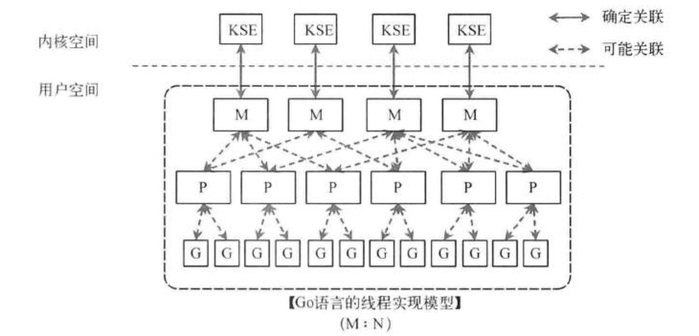

众所周知，Go 的一大特色是 **goroutine（协程 / 轻量级线程）**，这也是 Go 并发模型的核心。为了高效调度这些 goroutine，Go 使用了 **GMP 模型**。

在这个模型中：
- **G** 代表 goroutine
- **M** 代表内核线程
- **P** 代表处理器

内核的线程和用户线程是 **一一对应** 的。用户态线程存在的目的，本质上就是为了和内核线程进行绑定。

P（处理器上下文有两个功能：

1. **挂载队列** —— 存放 goroutine。
2. **执行** —— 负责实际调度。

同时，P 是稀缺资源，它的数量是由环境变量（`GOMAXPROCS`）决定的。

---

## 抛弃

当某个 goroutine 在用户态执行时陷入 **系统调用**，就会发生 P 的转移。

具体过程：

- 当前线程会把上下文 P，以及未陷入系统调用的 goroutine，交给其他线程 T 去继续执行。
- 自身则等待系统调用返回。
- 系统调用返回后，原本的线程已经没有 P 了，因此它需要把自己携带的 goroutine 转交给其他线程 T。
- 如果对方线程 T 不接受，那么就把 goroutine 放到 **全局队列**（全局队列大小是有限制的）。
- 而失去 P 的用户线程自己会进入 **线程池**。如果线程池已经满了，就不会再放进去。

这就是我们常说的 **抛弃 P**。

---

## 偷

所有的 P 都会定期检测 **全局队列**，看看是否有 goroutine。

- 如果有，就从全局队列里拿过来执行。
- 如果全局队列没有，就会选择去 **其他 P 的队列里偷**。

偷的策略是 **折半偷取**：从别的 P 队列里拿一半过来。

这样的机制，能避免：

- 有的线程空闲，没事干。
- 有的 P 队列太长，goroutine 堆积。

也就是常说的“避免过累过闲”的问题。